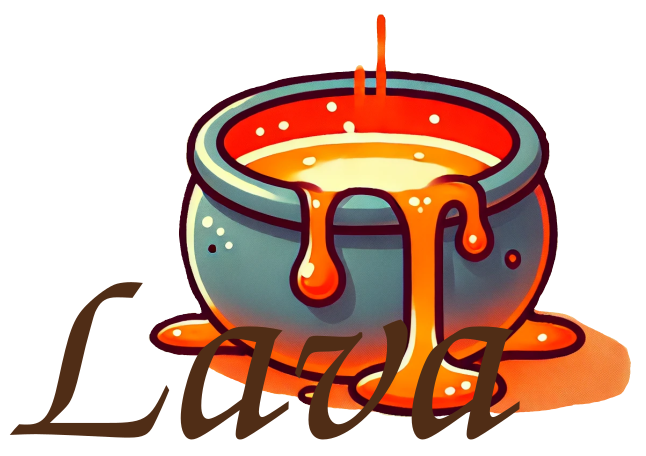

# `lava` - A C/C++ GPGPU computing library based on Vulkan

<!-- add image -->
<!--  -->

## Description

`lava` is a C/C++ GPGPU computing library based on Vulkan. It is designed to provide a simple and easy-to-use API for developers to write GPGPU computing programs in C/C++. **It is a work-in-progress project and is not yet ready for production use.**

This library will rely on [VulkanMemoryAllocator (VMA)](https://github.com/GPUOpen-LibrariesAndSDKs/VulkanMemoryAllocator) and [vk-Bootstrap](https://github.com/charles-lunarg/vk-bootstrap) for Vulkan initialization.

As the project progresses, bindings to **Python** and **Fortran** will be added.

## Current status

This project is currently in the early stages of development. The `main` branch contains a somewhat working example for a simple GPGPU computing program. The `dev` branch contains the latest changes and updates. Once a feature is stable, it will be merged into the `main` branch.

## License

This project is licensed under the MIT License - see the [LICENSE](./LICENSE.txt) file for details.